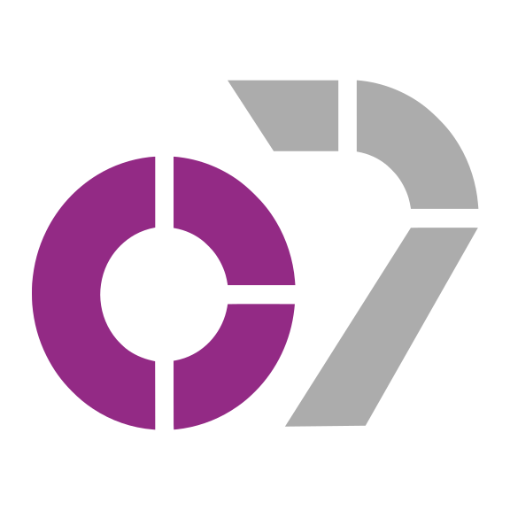
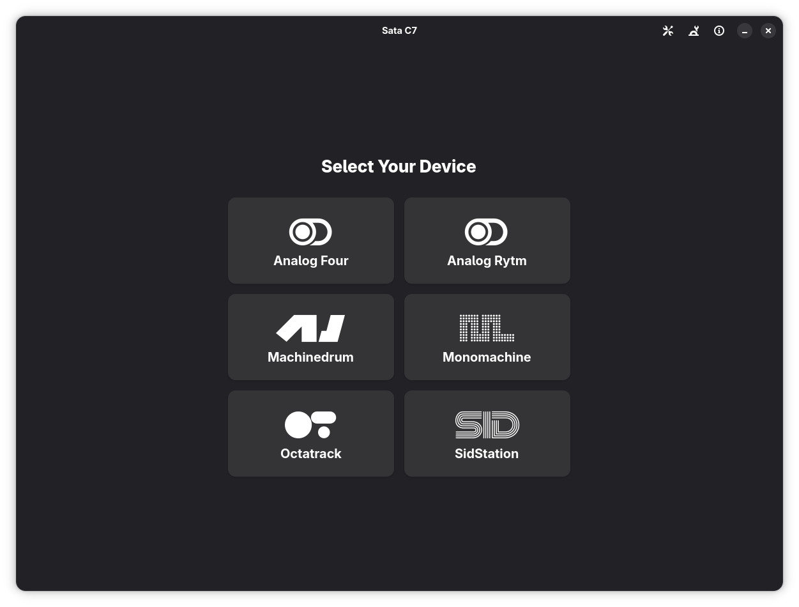
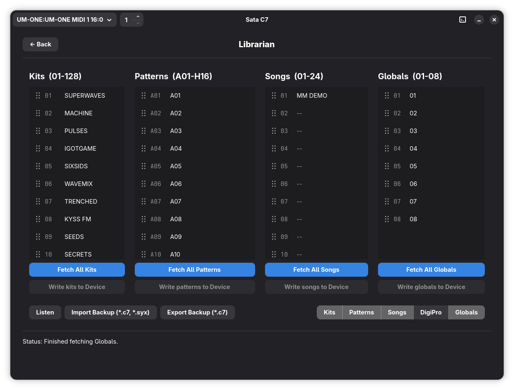
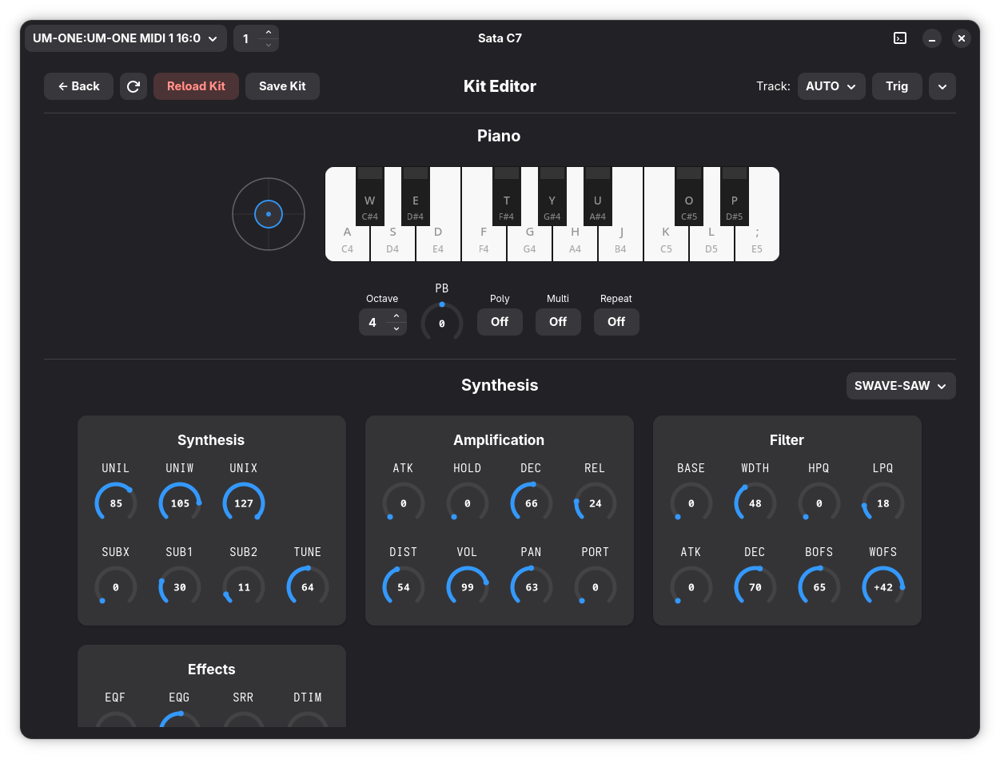
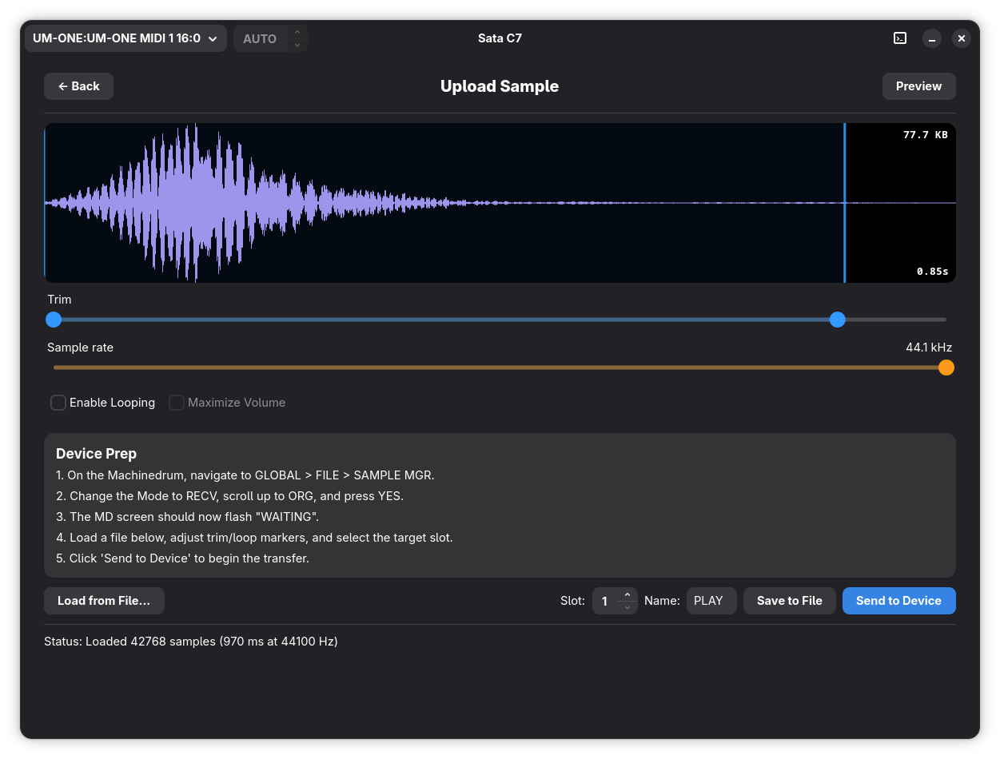
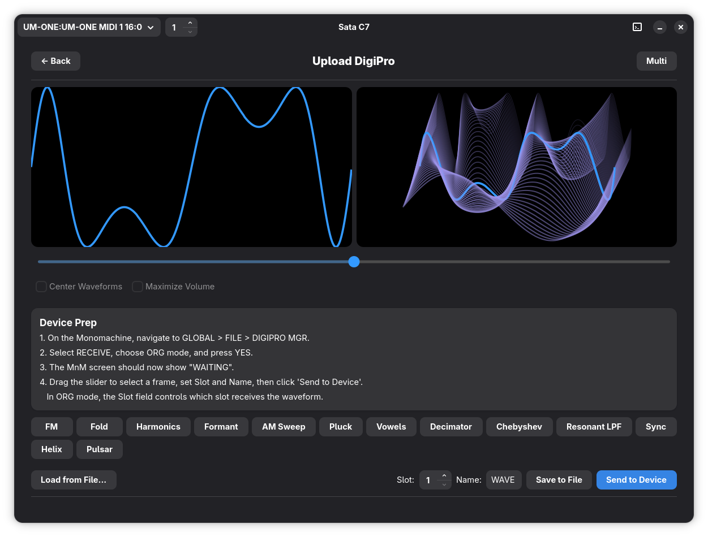

    
    
    

---

C7 is a desktop application designed to control [legacy Elektron hardware](https://www.elektron.se/legacy) with [SysEx & MIDI](https://en.wikipedia.org/wiki/MIDI#SysEx).

The project is centered around controlling the [Elektron Monomachine](https://en.wikipedia.org/wiki/Elektron_Monomachine) and [Elektron Machinedrum](https://synthpedia.net/elektron/machinedrum/). Other devices are supported but could be [missing some features](crates/c7_core/devices/README.md).

## Features

- Manage kits, sounds, patterns, songs, samples, configurations, and more with the `.c7` format.
- Automate all device parameters to your [DAW](https://en.wikipedia.org/wiki/Digital_audio_workstation) with the C7 Bridge plugin.
- Backup and restore all system data.
- Edit all device parameters through the GUI.
- Send firmware updates.
- Upload [SDS](https://en.wikipedia.org/wiki/MIDI#Sample_dump_standard) samples to the Machinedrum & [Analog Rytm](https://synthpedia.net/elektron/analog-rytm/).
- Upload DigiPro [wavetables](https://en.wikipedia.org/wiki/Wavetable_synthesis) to the Monomachine.

## Installation

1. Download a package from the [releases](https://github.com/sata1000000/C7/releases/) page.
2. Open it.

> [!WARNING]
> C7 is in beta until October 5, 2026. Any `.c7` files created are not guaranteed to work when the project goes out of beta.

## Screenshots

  
  
  
  
  

## Todo

- Block out-of-range notes from being able to fire in C7 Bridge.
- Add [NRPN](https://en.wikipedia.org/wiki/NRPN) and [14-bit CC](https://midi.org/midi-1-0-control-change-messages) knob support to C7 Bridge.
- Add basic support for [other Elektron devices](crates/c7_core/devices/README.md).

## Wishlist

- Figure out how to properly handle device submodels.
- Add device-outline icons for each device, rather than using official logos.
- Split up large UI files (like [kit_editor.rs](crates/c7_app/src/ui/screens/kit_editor.rs) & [librarian.rs](crates/c7_app/src/ui/screens/librarian.rs)).
- Switch C7 Bridge from [CLAP](https://en.wikipedia.org/wiki/CLever_Audio_Plug-in) to [VST3](https://en.wikipedia.org/wiki/Virtual_Studio_Technology).
- Add bidirectional MIDI in C7 Bridge.
- Make the blue accent follow OS accent colors.
- Add a song constructor screen.
- Add device auto-detection.
- Add ability to preview audio from the loaded wavetable.
- Add support for opening `.c7` files directly.
- Add C7 to [Winget](https://learn.microsoft.com/en-us/windows/package-manager/winget/), [Homebrew](https://brew.sh/), & [Flathub](https://flathub.org/).
- Add a Linux aarch64 build.